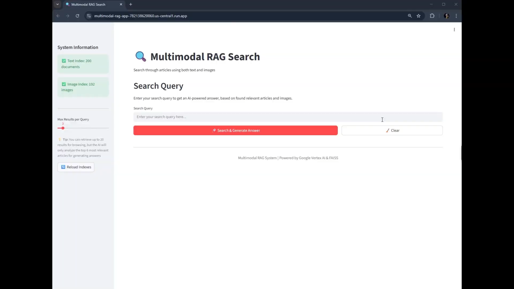

# Multimodal RAG System for AI News Articles

Retrieval-Augmented Generation (RAG) system that enables search and question-answering across both text content and images from AI news articles. The system scrapes articles from The Batch newsletter, creates searchable vector indexes, and provides AI-powered answers using Google's Gemini models.

---

## Live Demo

**Try the application here:** [https://multimodal-rag-app-782138620060.us-central1.run.app/](https://multimodal-rag-app-782138620060.us-central1.run.app/)

---

## Demo: Video Example

[](https://drive.google.com/file/d/1s1ZNfruw_p3O0izGAWp_sTA9MVovpBIk/view?usp=drive_link)

---


## Project Overview

This system demonstrates a complete multimodal RAG pipeline that:
- **Scrapes** AI news articles and associated images from The Batch newsletter
- **Processes** both textual content and visual information into vector embeddings
- **Indexes** data using FAISS for efficient similarity search
- **Retrieves** relevant context from both text and images based on user queries
- **Generates** comprehensive answers using Google's Gemini 2.0 Flash model with vision capabilities

---

## System Architecture

### Technical Approach

The system implements a **bidirectional multimodal RAG architecture with evaluation** where:

1. **Text Processing Pipeline**:
   - Articles are chunked and embedded using Google's `gemini-embedding-001` model
   - Text embeddings capture semantic meaning of article content
   - FAISS indexes enable fast similarity search

2. **Image Processing Pipeline**:
   - Images are embedded using Vertex AI's `multimodalembedding@001` model
   - Contextual text (article titles) enhance image embeddings
   - Separate FAISS index for visual content

3. **Retrieval Strategy**:
   - Parallel search across both text and image indexes
   - Results ranked by semantic similarity to query
   - Associated images linked to their source articles

4. **Answer Generation**:
   - Top-k relevant documents retrieved (default: 3 articles, 3 images)
   - Content sent to Gemini 2.0 Flash with vision capabilities
   - Model analyzes both textual and visual information
   - Generates comprehensive, well-structured answers

5. **Evaluation Framework**:
   - Automated test case generation using GPT models from document corpus
   - Multi-dimensional RAG evaluation with DeepEval framework
   - LLM-as-judge assessment across faithfulness, relevancy, and retrieval quality
   - Performance benchmarking with interpretable scoring thresholds

### Tools & Models Selected

| Component | Technology | Reasoning |
|-----------|------------|-----------|
| **Web Scraping** | Scrapy | Robust, efficient crawler with built-in rate limiting and respect for robots.txt |
| **Text Embeddings** | Google Gemini Embedding (gemini-embedding-001) | High-quality 768-dimensional embeddings optimized for retrieval tasks |
| **Image Embeddings** | Vertex AI Multimodal Embedding (multimodalembedding@001) | 1408-dimensional embeddings supporting both visual and contextual text |
| **Vector Store** | FAISS (Facebook AI Similarity Search) | Efficient similarity search, persistent storage, works well with LangChain |
| **LLM** | Google Gemini 2.0 Flash | Multimodal capabilities, fast inference, supports vision + text reasoning |
| **Evaluation Framework** | DeepEval + GPT o3-mini | LLM-as-judge evaluation with RAG-specific metrics, automated test generation |
| **Framework** | LangChain | Simplifies integration between embeddings, vector stores, and LLMs |
| **UI** | Streamlit | Rapid development, interactive components, easy deployment |

### Design Decisions

**1. Separate Vector Stores for Text and Images**
- Improves embedding quality
- Allows different retrieval strategies per modality
- Simplifies maintenance and updates

**2. Contextual Text for Image Embeddings**
- Article titles provide semantic context for images
- Improves embedding quality and retrieval accuracy
- Bridges gap between visual and textual information

---

## Prerequisites

- **Python**: 3.10 or higher
- **Google Cloud Project**: With Vertex AI API enabled
- **Google API Key**: For Gemini models
- **OpenAI API Key**: For evaluation with DeepEval (optional)
- **Operating System**: Linux, macOS, or Windows (WSL recommended for Windows)

---

## Setup Instructions

### 1. Clone the Repository

```bash
git clone https://github.com/chewnusi/multimodal_rag
cd multimodal_rag
```

### 2. Install Dependencies

```bash
# Create virtual environment (recommended)
python -m venv .venv
source .venv/bin/activate

# Install required packages
pip install -r requirements.txt
```

### 3. Configure Environment Variables

Create a `.env` file in the project root:

```bash
# Required: Google Cloud Project ID (for Vertex AI)
PROJECT_ID=your-google-cloud-project-id

# Required: Google API Key (for Gemini models)
GOOGLE_API_KEY=your-google-api-key

# Required for Evaluation: OpenAI API Key (for DeepEval)
OPENAI_API_KEY=your-openai-api-key

# Optional: LangSmith tracing (for debugging)
LANGSMITH_TRACING=false # set to true for enabling
LANGSMITH_ENDPOINT="https://api.smith.langchain.com"
LANGSMITH_API_KEY=""
LANGSMITH_PROJECT=""
```

**Getting Your Credentials:**

1. **PROJECT_ID**: 
   - Go to [Google Cloud Console](https://console.cloud.google.com)
   - Create or select a project
   - Enable Vertex AI API: `gcloud services enable aiplatform.googleapis.com`
   - Set quota project: `gcloud auth application-default set-quota-project PROJECT_ID`

2. **GOOGLE_API_KEY**:
   - Visit [Google AI Studio](https://makersuite.google.com/app/apikey)
   - Create an API key for Gemini models

3. **OPENAI_API_KEY** (for evaluation):
   - Visit [OpenAI Platform](https://platform.openai.com/api-keys)
   - Create an API key for GPT models used in evaluation
   - Only needed if running system evaluation with DeepEval

### 4. Authenticate with Google Cloud

```bash
# Set up application default credentials
gcloud auth application-default login

# Set quota project (important for Vertex AI)
gcloud auth application-default set-quota-project PROJECT_ID
```

---

## Usage Guide

### Step 1: Scrape Articles (Optional)

The repository includes sample data, but you can scrape fresh articles:

```bash
cd batch_scraper
# Scrape specific number of articles
scrapy crawl batch_news -a max_articles=50 -s CLOSESPIDER_ITEMCOUNT=50
```

### Step 2: Create Vector Indexes (Optional)

Sample indexes are included, but you can recreate them from freshly scraped data:

```bash
# From project root
# Create both text and image indexes
python3 src/create_indexes.py

# Create only text index
python3 src/create_indexes.py --text-only

# Create only image index
python3 src/create_indexes.py --image-only

# Force recreate existing indexes
python3 src/create_indexes.py --force

# Check environment without creating indexes
python3 src/create_indexes.py --check

# Create in root folder or with custom paths
python3 src/create_indexes.py --data data --indexes indexes
```

**Important Note:**
- **Image Processing Time**: Expect 20-30 minutes for 200 images due to API rate limits

### Step 3: Run the Application

```bash
# From project root
streamlit run app/streamlit_app.py
```

### Step 4: Evaluate System Performance (Optional)

```bash
# Generate test cases from your documents
python3 evaluate/generate_testset.py
```

This creates:
- `evaluate/testset.json` - Test cases with queries and expected answers
- `evaluate/testset.csv` - Same data in CSV format
- `evaluate/sampled_documents.txt` - List of documents used for generation

```bash
# Run evaluation
python3 evaluate/evaluate_rag.py

# Use not default path to test set
python3 evaluate/evaluate_rag.py --testset evaluate/testset.json

# Custom retrieval parameters
python3 evaluate/evaluate_rag.py --k-text 7 --n-articles 4
    
# Quick evaluation on subset
python3 evaluate/evaluate_rag.py --max-samples 3
```

**Note**: Evaluation requires OpenAI API access and may take several minutes depending on test set size.

---

## How It Works

### Search & Retrieval Flow

```
User Query
    ↓
[Query Embedding]
    ↓
    ├─→ [Text Vector Store] → Top-k Text Results
    └─→ [Image Vector Store] → Top-k Image Results
    ↓
[Result Merging & Linking]
    ↓
[Context Preparation]
    ↓
[Gemini 2.0 Flash + Vision]
    ↓
AI-Generated Answer
```

---

## RAG System Evaluation

### Evaluation Metrics

The system evaluates five key aspects of RAG performance:

#### 1. **Faithfulness** (Factual Grounding)
- **Measures**: Whether answers are supported by retrieved context

#### 2. **Answer Relevancy** (Query Alignment)
- **Measures**: How directly answers address the input question

#### 3. **Contextual Relevancy** (Retrieval Quality)
- **Measures**: How relevant retrieved documents are to the query

#### 4. **Contextual Precision** (Ranking Quality)
- **Measures**: Whether relevant documents rank higher than irrelevant ones

#### 5. **Contextual Recall** (Information Coverage)
- **Measures**: Whether all necessary information was retrieved

### Performance Benchmarks

The values below are the average scores computed across the 15 test cases included with this repository (see `evaluate/testset.json`).

- **Faithfulness**: 0.8926
- **Answer Relevancy**: 0.8009
- **Contextual Relevancy**: 0.2579
- **Contextual Precision**: 0.8112
- **Contextual Recall**: 0.8667

The system demonstrates strong performance across most metrics, that indicates that the answers are trustworthy and comprehensive. The lowest score is Contextual Relevancy, indicating that while the system finds the correct information (Contextual Recall score is high), it retrieves far too much irrelevant text alongside it. This is caused by document ingestion strategy: usage of articles as single units, without breaking articles into smaller, semantically-focused paragraphs or sections.